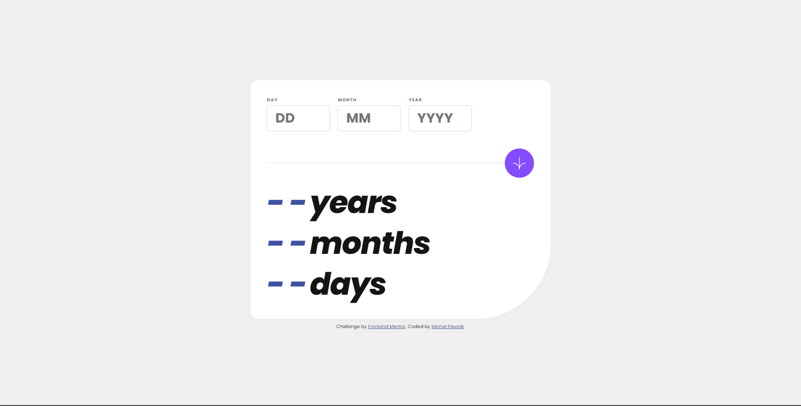
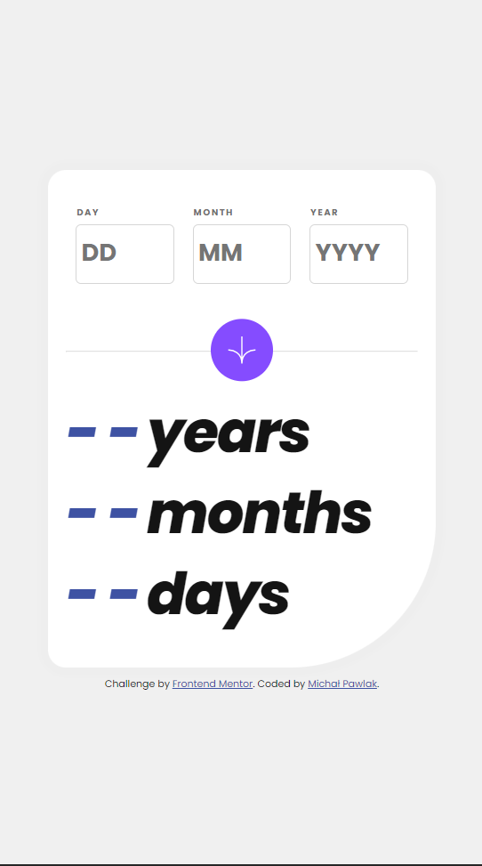
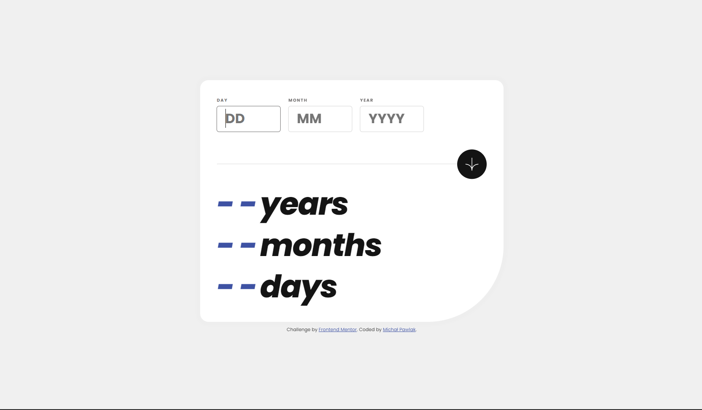
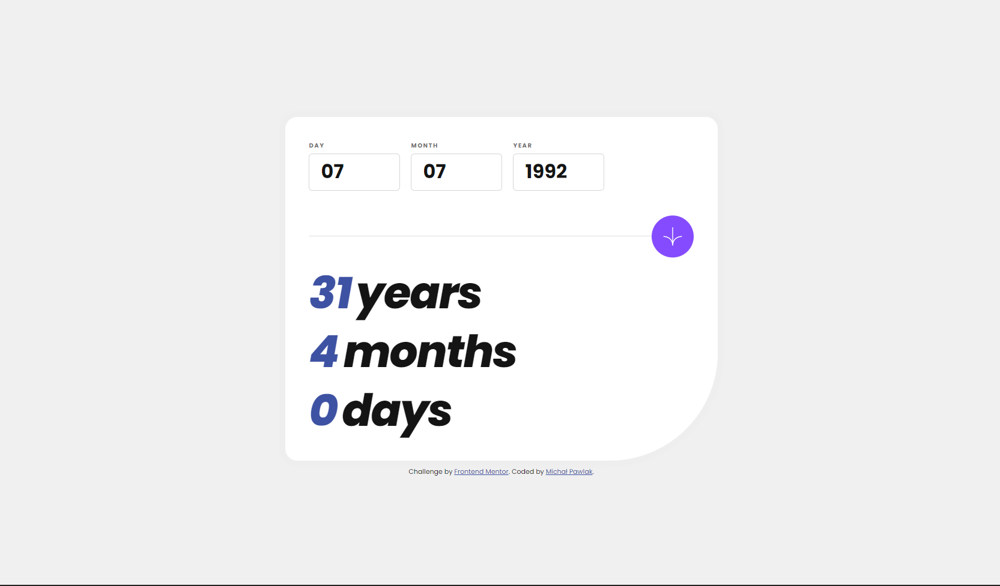
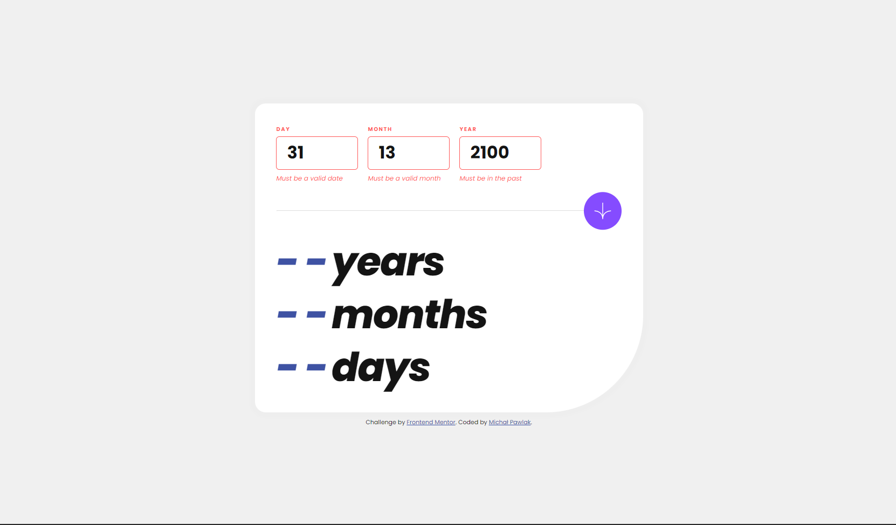

# Frontend Mentor - Age calculator app solution

## Table of contents

- [Overview](#overview)
  - [The challenge](#the-challenge)
  - [Screenshot](#screenshot)
  - [Links](#links)
- [My process](#my-process)
  - [Built with](#built-with)
  - [What I learned](#what-i-learned)
  - [Continued development](#continued-development)
- [Author](#author)

## Overview

### The challenge

Users are be able to:

- View an age in years, months, and days after submitting a valid date through the form
- Receive validation errors if:
  - Any field is empty when the form is submitted
  - The day number is not between 1-31
  - The month number is not between 1-12
  - The year is in the future
  - The date is invalid e.g. 31/04/1991 (there are 30 days in April)
- View the optimal layout for the interface depending on their device's screen size
- See hover and focus states for all interactive elements on the page

### Screenshot

### Links

- Solution URL: https://github.com/MichalPawlak0/age-calculator-app
- Live Site URL: https://michal-pawlak-age-calculator.netlify.app/

## My process

### Built with

- Semantic HTML5 markup
- CSS custom properties
- Vanilla JavaScript
- Flexbox
- Desktop-first workflow

### What I learned

Learned about the "defer" keyword.
Learned handling user input.
Learned working with forms.
Learned about possible attributes in form, input and label elements.

### Continued development

Next - build the animation in which numbers animate from 0 all the way to calculated values.

Also - will learn error handling with catch and throw.

## Author

- Website - https://michal-pawlak.netlify.app/
- Frontend Mentor - https://www.frontendmentor.io/profile/MichalPawlak0